# Running a node to accept Bitcoin payments

Building a Bitcoin/Lightening Node on a VM with BTC pay server on top of your node installation in order to accept payments.
- Security :  Setting up SSH login, Enabling the UFW, install fail2ban
- Bitcoin : Installing Bitcoind and turning it into a service
- Lightning : Lightning Network Daemon by Lightning Labs
- BTC Pay server

## Prerequisites
1) Update the Software 

```bash
sudo apt update
sudo apt full-upgrade
```

## Security

The node need to be secure against attacks (because the VM will be visible from the outside) , we will secure the login with SSH key and disable the password. Then we will enable the Uncomplicated Firewall to control who is pirmitted (SSH and Electrum) . To prevent an attacker to try different password , we will use fail2ban (after five failed login attempts the service close acces for 10 minutes).

1) Log to the VM with Putty 
> [PuTTY](https://www.chiark.greenend.org.uk/~sgtatham/putty/latest.html) is an SSH and telnet client , download it and conect to the VM host with your credentials (host name,username and password)


<p align="center"> 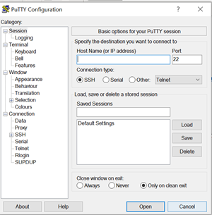 </p>

2) Login with SSH keys:
>  [Follow this guide](https://www.tecmint.com/ssh-passwordless-login-with-putty/) to generate SSH keys with PUTTY and login remotly to the server without passwords.

Generate the keys (public and private) and save them to a secure location.
Keep the public key in a text filed and paste it into the `.ssh/authorized_keys` file , we can add to this file all the public key authorized to acces to our server.
Save a session to automatically connect and login to the server with our orivate key.

<p align="center"> 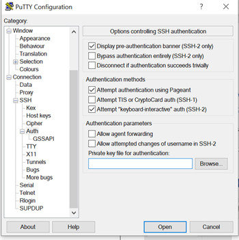 </p>

3) Disable the password

`!Make sure that you can connect with your SSH keys before!`
```bash
sudo nano /etc/ssh/sshd_config
```
We need to edit the SSH configuration and setting “ChallengeResponseAuthentication” and “PasswordAuthentication” to “no”, save it and restarting the SSH daemon and exit.
```sh
sudo systemctl restart sshd
exit
```

4) Enabling the UFW

```sh
sudo apt install ufw
sudo su
ufw default deny incoming
ufw default allow outgoing
ufw allow 22    comment 'allow SSH'
ufw allow 50002 comment 'allow Electrum SSL'
ufw enable
systemctl enable ufw
ufw status
```

5) Fail2ban

```sh
sudo apt install fail2ban
```
## Install dependencies


### Bitcoin Core

1) Installation of bitcoind

With Admin 
```sh
cd /tmp
```
[Download](https://bitcoincore.org/en/download) the latest update and check the integrity

```sh
# download Bitcoin Core binary
BITCOIN_VERSION="22.0"
BITCOIN_URL="https://bitcoincore.org/bin/bitcoin-core-22.0/bitcoin-22.0.tar.gz"
BITCOIN_SHA256="d0e9d089b57048b1555efa7cd5a63a7ed042482045f6f33402b1df425bf9613b"

cd /tmp
wget -O bitcoin.tar.gz "$BITCOIN_URL"
echo "$BITCOIN_SHA256 bitcoin.tar.gz" | sha256sum -c - && \
mkdir bin && \
sudo tar -xzvf bitcoin.tar.gz -C /usr/local/bin --strip-components=2 "bitcoin-$BITCOIN_VERSION/bin/bitcoin-cli" "bitcoin-$BITCOIN_VERSION/bin/bitcoind"
rm bitcoin.tar.gz
```

2) Configuration of Bitcoind 

Bitcoin daemon will run in the background , we want it in testnet mode.

We configure bitcoind in `bitcoin.conf`:
```sh
sudo nano ~/.bitcoin/bitcoin.conf
```
```sh
# ~/.bitcoin/bitcoin.conf

server=1
listen=1
daemon=1
testnet=1
txindex=1
#Config setting for -bind only applied on test network when in [test]section.
#[test]
#bind=127.0.0.1
whitelist=127.0.0.1
rpcuser=satoshi
rpcpassword=satoshi
zmqpubrawblock=tcp://127.0.0.1:18501
zmqpubrawtx=tcp://127.0.0.1:18502

```

Start bitcoind manually :
```sh
bitcoind --testnet
```
To debug do :
```sh
sudo tail -f ~/.bitcoin/testnet3/debug.log 
```
Verify by getting the blockchain info : 
```sh
bitcoin-cli getblockchaininfo
```
3) Turning Bitcoind into a service

We configure the service in `bitcoin.service`:

```sh
sudo nano /etc/systemd/system/bitcoind.service
```
```sh
# /etc/systemd/system/bitcoind.service

[Unit]
Description=Bitcoin daemon
After=network.target

[Service]

# Service execution
###################

ExecStart=/usr/local/bin/bitcoind -daemon \
                                  -testnet \
                                  -pid=/run/bitcoind/bitcoind.pid \
                                  -conf=/home/administrateur2/.bitcoin/bitcoin.conf \
                                  -datadir=/home/administrateur2/.bitcoin


# Process management
####################

Type=forking
PIDFile=/run/bitcoind/bitcoind.pid
Restart=on-failure
TimeoutSec=300
RestartSec=30


# Directory creation and permissions
####################################

# Run as bitcoin:bitcoin
User=administrateur2
Group=administrateur2

# /run/bitcoind
RuntimeDirectory=bitcoind
#RuntimeDirectoryMode=0710
RuntimeDirectoryMode=0770

# Hardening measures
####################

PermissionsStartOnly=True

# Provide a private /tmp and /var/tmp.
PrivateTmp=true

# Mount /usr, /boot/ and /etc read-only for the process.
ProtectSystem=full

# Deny access to /home, /root and /run/user
#ProtectHome=true

# Disallow the process and all of its children to gain
# new privileges through execve().
NoNewPrivileges=true

# Use a new /dev namespace only populated with API pseudo devices
# such as /dev/null, /dev/zero and /dev/random.
PrivateDevices=true

# Deny the creation of writable and executable memory mappings.
MemoryDenyWriteExecute=true

[Install]
WantedBy=multi-user.target
```
Enable the service
```sh
 sudo systemctl enable bitcoind.service
```

To monitor you can check the bitcoind status with :
```sh
 systemctl status bitcoind.service
```

<p align="center"> 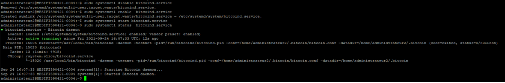 </p>

```sh
 sudo tail -f /mnt/ext/bitcoin/debug.log
```
Let Bitcoin Core sync fully it can take severals hours or days. 


### Lightning
1)  Install of Go lang
```sh
cd /tmp
wget https://dl.google.com/go/go1.13.3.linux-amd64.tar.gz
tar -xvf go1.13.3.linux-amd64.tar.gz
sudo mv go /usr/local
```
Create a folder and export GO
```sh
mkdir ~/go
echo "export GOPATH=~/go" >> ~/.bashrc
echo "export PATH=$GOPATH/bin:/usr/local/go/bin:$PATH" >> ~/.bashrc
source ~/.bashr
go version
```
2) Installation of LND

[Follow this guide](https://freedomnode.com/blog/how-to-install-and-use-the-lightning-network-with-bitcoind-on-the-bitcoin-mainnet/) to install and configure LND.

```sh
git clone https://github.com/lightningnetwork/lnd $GOPATH/src/github.com/lightningnetwork/lnd
cd $GOPATH/src/github.com/lightningnetwork/lnd
make && make install
```
To update LND :
```sh
cd $GOPATH/src/github.com/lightningnetwork/lnd
git pull
make clean
make && make install
```
Verify the [install](https://github.com/lightningnetwork/lnd/blob/master/docs/INSTALL.md#installing-lnd-from-source) of LND:
```sh
cd $GOPATH/src/github.com/lightningnetwork/lnd
make check
```
If you have the error : "exec: "gcc": executable file not found in $PATH "  do :
```sh
sudo apt-get install build-essential
gcc --version
cd $GOPATH/src/github.com/lightningnetwork/lnd
Make check
```

3) Configuration of LND

We want LND to work with Bitcoin Core in.
```sh
mkdir ~/.lnd && cd ~/.lnd
touch lnd.conf
```
We configure LND in `lnd.conf`:
```sh
sudo nano ~/.lnd/lnd.conf
```
```sh
# ~/.lnd/lnd.conf

[Application Options]
listen=localhost
# Public P2P IP
externalip=localhost
alias=J&PNODE
# choose from: https://www.color-hex.com/
color=#3dc9b3
maxpendingchannels=5
#debuglevel=info
#debuglevel=trace
#debuglevel=debug
#debuglevel=error
#debuglevel=warn
#debuglevel=critical
# Log levels
debuglevel=CNCT=debug,CRTR=debug,HSWC=debug,NTFN=debug,RPCS=debug
profile=9736

# Fee settings - default LND base fee = 1000 (mSat), default LND fee rate = 1 (ppm)
# Forward fee rate in parts per million
bitcoin.basefee=1000
bitcoin.feerate=1

# Minimum channel size (in satoshis, default is 20,000 sats)
minchansize=100000

# Accept AMP (multi-paths) payments, wumbo channels and do not prevent the creation of anchor channel (default value)
accept-amp=true
protocol.wumbo-channels=true
protocol.no-anchors=false

# Save on closing fees
## The target number of blocks in which a cooperative close initiated by a remote peer should be confirmed (default: 10 blocks).
coop-close-target-confs=24

#########################
# Improve startup speed # (from https://www.lightningnode.info/advanced-tools/lnd.conf by Openoms)
#########################
# If true, we'll attempt to garbage collect canceled invoices upon start.
gc-canceled-invoices-on-startup=true
# If true, we'll delete newly canceled invoices on the fly.
gc-canceled-invoices-on-the-fly=true
# Avoid historical graph data sync
ignore-historical-gossip-filters=1
# Enable free list syncing for the default bbolt database. This will decrease
# start up time, but can result in performance degradation for very large
# databases, and also result in higher memory usage. If "free list corruption"
# is detected, then this flag may resolve things.
sync-freelist=true
# Avoid high startup overhead
# If true, will apply a randomized staggering between 0s and 30s when
# reconnecting to persistent peers on startup. The first 10 reconnections will be
# attempted instantly, regardless of the flag's value
stagger-initial-reconnect=true

########################
# Compact the database # (slightly modified from https://www.lightningnode.info/advanced-tools/lnd.conf by Openoms)
########################
# Can be used on demand by commenting in/out the two options below: it can take several minutes
[bolt]
# Whether the databases used within lnd should automatically be compacted on
# every startup (and if the database has the configured minimum age). This is
# disabled by default because it requires additional disk space to be available
# during the compaction that is freed afterwards. In general compaction leads to
# smaller database files.
db.bolt.auto-compact=true
# How long ago the last compaction of a database file must be for it to be
# considered for auto compaction again. Can be set to 0 to compact on every
# startup. (default: 168h; the time unit must be present, i.e. s, m or h, except for 0)
db.bolt.auto-compact-min-age=168h

[Bitcoin]
#bitcoin.mainnet=1
bitcoin.testnet=1
bitcoin.active=1
bitcoin.node=bitcoind

[Bitcoind]
bitcoind.rpcuser=satoshi
bitcoind.rpcpass=satoshi
bitcoind.zmqpubrawblock=tcp://127.0.0.1:18501
bitcoind.zmqpubrawtx=tcp://127.0.0.1:1850
```
We make LND accessible from the outside on port 9735:
```sh
sudo iptables -A INPUT -p tcp --dport 9735 -j ACCEPT
sudo iptables -A INPUT -p udp --dport 9735 -j ACCEPT

sudo iptables-save
```
With root do :
```sh
ufw allow 9735 comment '# allow LightningNet'
ufw allow 10009 comment '# allow lnd rpc'
```
4) Turning LND into a service

We configure the service in `lnd.service`:

```sh
sudo nano /etc/systemd/system/lnd.service
```
```sh
# /etc/systemd/system/lnd.service
[Unit]
Description=LND Lightning Daemon
Requires=bitcoind.service
After=bitcoind.service

[Service]
ExecStart=/home/administrateur2/go/bin/lnd
ExecStop=/home/administrateur2/go/bin/lncli stop
PIDFile=/run/lnd/lnd.pid

User=administrateur2
Group=administrateur2

# /run/lnd
RuntimeDirectory=lnd
RuntimeDirectoryMode=0770

#PermissionsStartOnly=True

# Process management
####################

Type=simple
KillMode=process
TimeoutStartSec=60
TimeoutStopSec=60
Restart=always
RestartSec=60

[Install]
WantedBy=multi-user.target
```
Enable the service
```sh
 sudo systemctl enable lnd
```
<p align="center"> 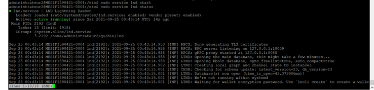 </p>

To monitor you can check the bitcoind status with :

```sh
systemctl status lnd
#Or
journalctl -fu lnd
#Or
tail -f ~/.lnd/logs/bitcoin/testnet/lnd.log
```
We need here to specify the location to start lnd :
For lnd do : ~/go/bin/lnd
For lncli do : ~/go/bin/lncli
Let's create [alias](https://www.tecmint.com/create-alias-in-linux/):

```sh
echo " alias tlncli='~/go/bin/lncli --network=testnet'" >> ~/.bashrc
# To acivate the change
source ~/.bashrc
```
Now instead of  "~/go/bin/lncli --network=testnet create" we can do "tlncli create" :
```sh
#Example:
tlncli create
tlncli getinfo
tlncli unlock
tlncli help
tlncli stop
```
5) Create the LND wallet
Do:
```sh
tlncli create
```
Follow the instructions and save the seed!
Unlock the wallet :
```sh
tlncli unlock
```
<p align="center"> 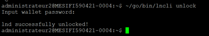 </p>

Check the info :
```sh
tlncli getinfo
```
<p align="center"> 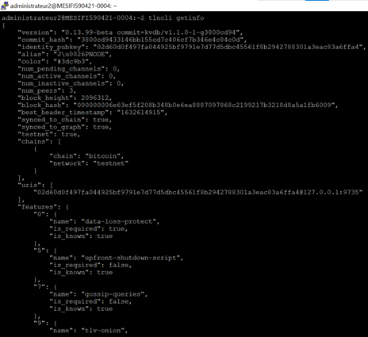 </p>

6) Funding the Lightning node

Generate a bitcoin address to receive the funds :
```sh
tlncli newaddress p2wkh
```
Install [Electrum](https://electrum.org/#download) in testnet 

Get tBTC with a faucet  and send some to the address:

- https://coinfaucet.eu/en/btc-testnet/
- https://bitcoinfaucet.uo1.net/
- https://testnet.qc.to/ 
- https://onchain.io/bitcoin-testnet-faucet

Then check :
```sh
tlncli walletbalance
```
<p align="center"> 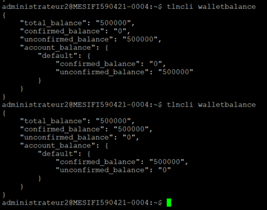 </p>

7) Opening a Channel

Find a [peer](https://1ml.com/testnet/)  , also see ["Identifying Good Peers"](https://docs.lightning.engineering/the-lightning-network/routing/identify-good-peers ) , then : 

Connect to the node 
```sh
tlncli connect <<pubkey>@host>

#EX
tlncli connect 038863cf8ab91046230f561cd5b386cbff8309fa02e3f0c3ed161a3aeb64a643b9@203.132.94.196:9735
```
Open a channel
```sh
tlncli openchannel <channel pubkey> --local_amt=<amt in satoshi that you commit to>

#EX
tlncli openchannel 038863cf8ab91046230f561cd5b386cbff8309fa02e3f0c3ed161a3aeb64a643b9 --local_amt=20000
```

Check :
```sh
tlncli walletbalance
tlncli channelbalance
tlncli listchannels
tlncli pendingchannels
```
<p align="center"> 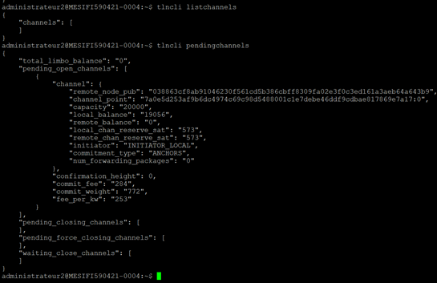 </p>
<p align="center"> 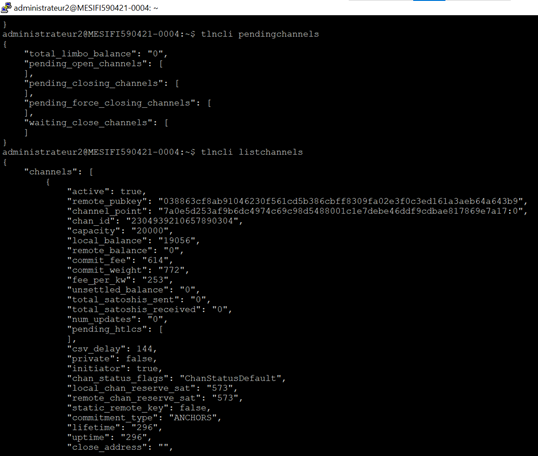 </p>

Make a Lightning Network payment /Make a [Transaction](https://testnet.yalls.org/)

Make a test payment :
```sh
#tlncli sendpayment --pay_req=<payment request> --amt=<amount in satoshi>

tlncli sendpayment --pay_req=lntb1500n1ps5lecxpp5m0amjgxk8dy04pykd2njhvsdq4vnhf6um9jmxmqlnsgv90qrf4esdpq2fjkzep6yp2xs6tnyp5hxgrpyp6x2um5cqzpgxqr23ssp58sw376xru6x8deqcdnr7emr4f7jntlgaafk9vlkc4gzqhymrft2q9qyyssqkfdrfk44l35u22jsdgwna8pnuwcas2vecqscl8k9xvr26gfaafz4f8fd5fwrwlwjpwqhh9tdnusqjdm6z9c658guqls2fxzlm7wehjgppffg0r

#checking the balance
tlncli walletbalance
tlncli channelbalance
```
### .Net Core SDK v3.1
Install : 
```sh
wget -q https://packages.microsoft.com/config/ubuntu/18.04/packages-microsoft-prod.deb
sudo dpkg -i packages-microsoft-prod.deb
sudo apt-get install apt-transport-https
sudo apt-get update
sudo apt-get install -y dotnet-sdk-3.1
```
### NBXplorer
1) Install 
```sh
cd ~
git clone https://github.com/dgarage/NBXplorer
cd NBXplorer
./build.sh
```
2) Create a configuration file 
```sh
mkdir -p ~/.nbxplorer/Main
cd ~/.nbxplorer/Main
touch settings.config
nano ~/.nbxplorer/Main/settings.config
```
We configure nbxplorer in `settings.config`
```sh
#btc.rpc.auth=satoshi:satoshi
btc.rpc.user=satoshi
btc.rpc.password=satoshi
port=24445
testnet=1
```
Verify the settings :
```sh
/usr/bin/dotnet ~/NBXplorer/NBXplorer/bin/Release/netcoreapp3.1/NBXplorer.dll -c ~/.nbxplorer/Main/settings.config 
```
Do  with root :
```sh
ufw allow 24445 comment '# allow NBXplorer' 
```
3) Turn it into a servie 
```sh
sudo nano /etc/systemd/system/nbxplorer.service 
```
```sh
#/etc/systemd/system/nbxplorer.service

[Unit]
Description=NBXplorer daemon
Requires=bitcoind.service
After=bitcoind.service

[Service]
ExecStart=/usr/bin/dotnet "home/administrateur2/NBXplorer/NBXplorer/bin/Release/netcoreapp3.1/NBXplorer.dll" -c /home/administrateur2/.nbxplorer/Main/settings.config
User=administrateur2
Group=administrateur2
Type=simple
PIDFile=/run/nbxplorer/nbxplorer.pid
Restart=on-failure

PrivateTmp=true
ProtectSystem=full
NoNewPrivileges=true
PrivateDevices=true

[Install]
WantedBy=multi-user.target 
```
Enable the service
```sh
 sudo systemctl enable nbxplorer.service
```
### PostgreSQL

Install : 
```sh
sudo apt install postgresql postgresql-contrib
sudo -i -u postgres

#create db user
createuser --pwprompt --interactive

# create db
createdb -O satoshi btcpayserver

exit
```

Do with root : 
```sh
ufw allow 5432 comment '# allow postgresql'
```

Monitor with :
```sh
service postgresql status
```
### BTC Pay server 

1) Install
```sh
cd ~
git clone https://github.com/btcpayserver/btcpayserver
cd btcpayserver
./build.sh
```
2) Create a configuration file 
```sh
mkdir -p ~/.btcpayserver/Main
cd ~/.btcpayserver/Main
touch settings.config
nano ~/.btcpayserver/Main/settings.config
```
We configure btcpayserver in `settings.config`
```sh
network=testnet
port=23001
bind=0.0.0.0
chains=btc
BTC.explorer.url=http://127.0.0.1:24445
#BTC.lightning=type=lnd-rest;server=https://127.0.0.1:8080/;macaroonfilepath=~/.lnd/data/chain/bitcoin/testnet/admin.macaroon;certthumbprint=<finger print>

BTC.lightning=type=lnd-rest;server=https://127.0.0.1:8080/;macaroon=<hex>;certthumbprint=<finger print>
postgres=User ID=satoshi;Password=satoshi;Host=localhost;Port=5432;Database=btcpayserver;
```
To get the macaroon (the macaroon parameter expects the HEX value) do :
```sh
xxd -plain ~/.lnd/data/chain/bitcoin/testnet/admin.macaroon | tr -d '\n'
```
The certthumbprint can be obtained using this command :
```sh
openssl x509 -noout -fingerprint -sha256 -in ~/.lnd/tls.cert | sed -e 's/.*=//;s/://g'
```
We make BtcPayServer accessible from the outside on port 2301:
```sh
sudo iptables -A INPUT -p tcp --dport 23001 -j ACCEPT
```
Do with root : 
```sh
ufw allow 23001 comment '# allow btcpayserver'
```
With putty in SSH>Auth>Tunnels set up a port forwarding on the port 23001 and 80 :
<p align="center"> 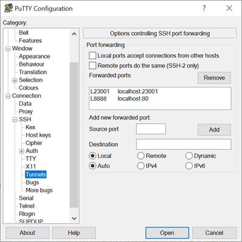 </p>

Verify the settings :
```sh
/usr/bin/dotnet run -p ~/btcpayserver/BTCPayServer/BTCPayServer.csproj -c ~/.btcpayserver/Main/settings.config --network=testnet
```
3) Turn it into a servie 
```sh
sudo nano /etc/systemd/system/ btcpayserver.service
```
```sh
# /etc/systemd/system/btcpayserver.service
[Unit]
Description=BtcPayServer daemon
Requires=btcpayserver.service
After=nbxplorer.service

[Service]
ExecStart=/usr/bin/dotnet run --no-launch-profile --no-build -c Release -p "/home/administrateur2/btcpayserver/BTCPayServer/BTCPayServer.csproj" -- $@
PIDFile=/run/btcpayserver/btcpayserver.pid

User=administrateur2
Group=administrateur2

# /run/lnd
RuntimeDirectory=btcpayserver
RuntimeDirectoryMode=0770

# Process management
####################
Type=simple
Restart=on-failure


[Install]
WantedBy=multi-user.target
```
Enable the service
```sh
 sudo systemctl enable btcpayserver.service
 sudo service btcpayserver status
 #monitor
 journalctl -fu btcpayserver
```
BTCPayServer administration :  http://localhost:23001/ 

4) [Register account ](https://docs.btcpayserver.org/RegisterAccount/ )
<p align="center"> 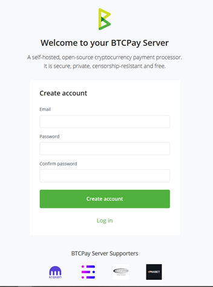 </p>

5) [Create a store](https://docs.btcpayserver.org/CreateStore/  )
<p align="center"> 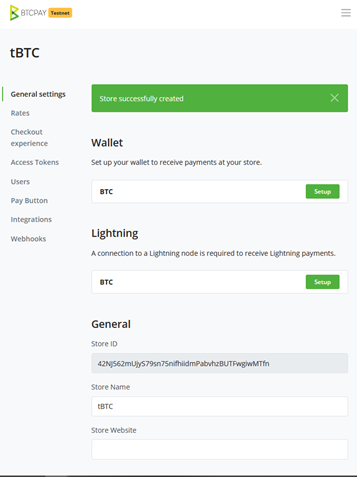 </p>

6) [Connect an existing wallet](https://docs.btcpayserver.org/ConnectWallet/ ) with [Electrum](https://docs.btcpayserver.org/ElectrumWallet/ ) 
<p align="center"> 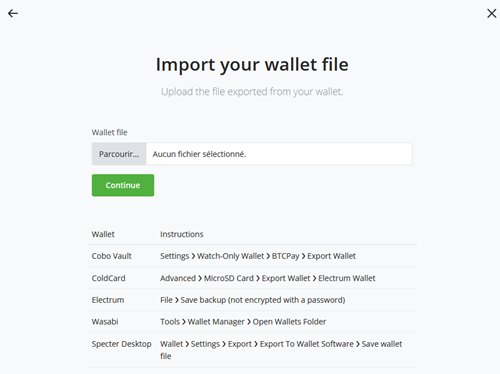 </p>

7) [Connecting our internal Lightning Node in BTCPay ](https://docs.btcpayserver.org/LightningNetwork/  )
<p align="center"> 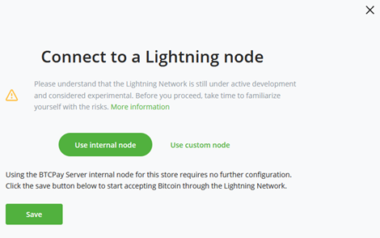 </p>
Test with public node info :
<p align="center"> 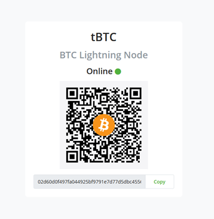 </p>

8) [Create Payment Button  ](https://www.youtube.com/watch?v=MIWGvl6_WzI )
<p align="center"> 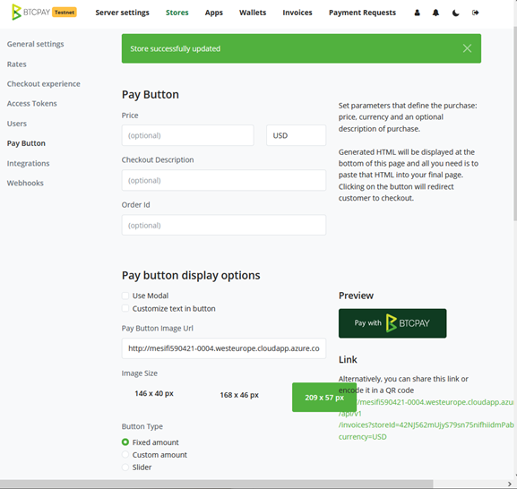 </p>

### Wordpress

1) Install follow the [guide](https://ubuntu.com/tutorials/install-and-configure-wordpress#1-overview)

Do with root : 
```sh
ufw allow 80 comment '# allow wordpress'
```
Open : http://localhost:8888  and Register

Create a Post or a page, for example,  and add buttons to pay with BTCPay :

<p align="center"></p>


## More

> For more see the following website
> - https://docs.btcpayserver.org/ManualDeployment/
> - https://freedomnode.com/blog/114/how-to-setup-btc-and-lightning-payment-gateway-with-btcpayserver-on-linux-manual-install 
> - https://ubuntu.com/tutorials/install-and-configure-wordpress#1-overview 
> - https://freedomnode.com/blog/how-to-install-and-use-the-lightning-network-with-bitcoind-on-the-bitcoin-mainnet/
> - https://docs.btcpayserver.org/Walkthrough/
> - https://docs.btcpayserver.org/WhatsNext/ 
